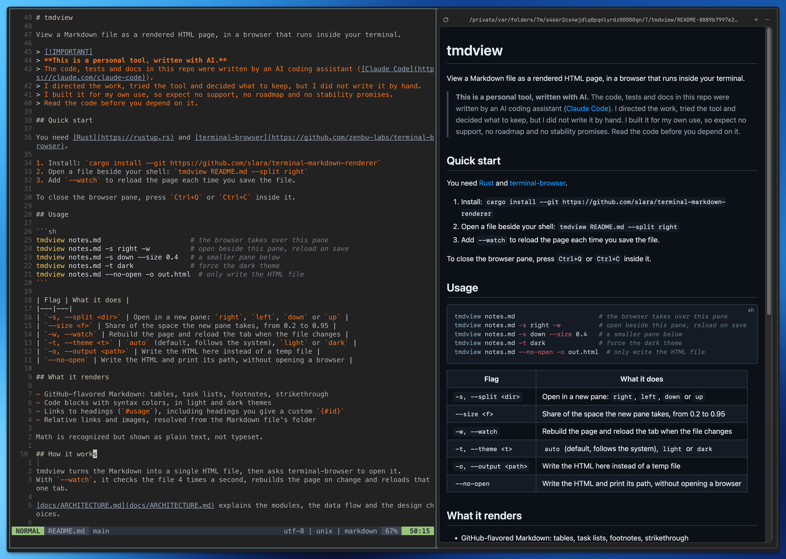
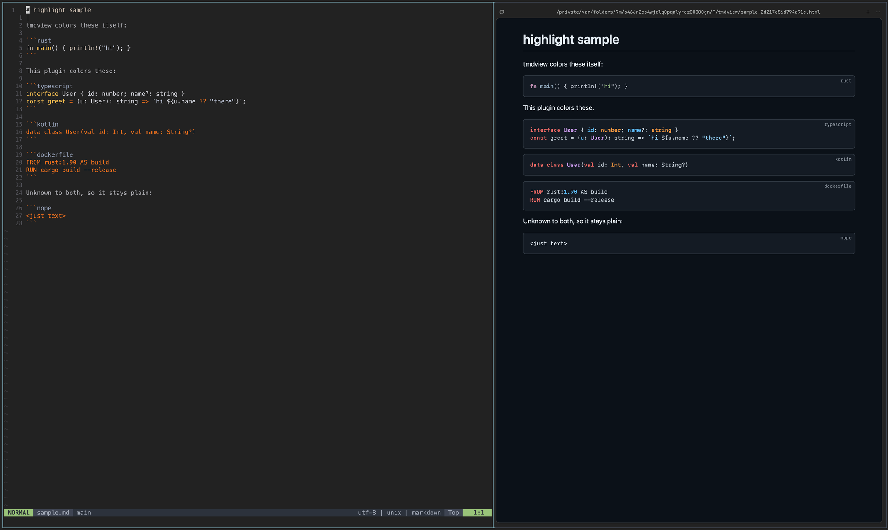

# tmdview

View a Markdown file as a rendered HTML page, in a browser that runs inside your terminal.



> [!IMPORTANT]
> **This is a personal tool, written with AI.**
> The code, tests and docs in this repo were written by an AI coding assistant ([Claude Code](https://claude.com/claude-code)).
> I directed the work, tried the tool and decided what to keep, but I did not write it by hand.
> I built it for my own use, so expect no support, no roadmap and no stability promises.
> Read the code before you depend on it.

## Quick start

You need [Rust](https://rustup.rs) and [terminal-browser](https://github.com/zenbu-labs/terminal-browser).

1. Install: `cargo install --git https://github.com/slara/terminal-markdown-renderer`
2. Open a file beside your shell: `tmdview README.md --split right`
3. Add `--watch` to reload the page each time you save the file.
4. Close the viewer: press `Ctrl+Q` inside the browser pane (`Ctrl+C` also works).

## Usage

```sh
tmdview notes.md                      # the browser takes over this pane
tmdview notes.md -s right -w          # open beside this pane, reload on save
tmdview notes.md -s down --size 0.4   # a smaller pane below
tmdview notes.md -t dark              # force the dark theme
tmdview notes.md --no-open -o out.html  # only write the HTML file
tmdview plugins install mermaid       # draw ```mermaid blocks as diagrams from now on
```

| Flag | What it does |
|---|---|
| `-s, --split <dir>` | Open in a new pane: `right`, `left`, `down` or `up` |
| `--size <f>` | Share of the space the new pane takes, from 0.2 to 0.95 |
| `-w, --watch` | Rebuild the page and reload the tab when the file changes |
| `-t, --theme <t>` | `auto` (default, follows the system), `light` or `dark` |
| `-o, --output <path>` | Write the HTML here instead of a temp file |
| `--no-open` | Write the HTML and print its path, without opening a browser |
| `--no-plugins` | Don't use installed plugins for this run |

| Key (inside the browser pane) | What it does |
|---|---|
| `Ctrl+Q` or `Ctrl+C` | Close the viewer. With `--watch`, tmdview stops within 2 seconds. |

## What it renders

- GitHub-flavored Markdown: tables, task lists, footnotes, strikethrough
- Code blocks with syntax colors, in light and dark themes
- Links to headings (`#usage`), including headings you give a custom `{#id}`
- Relative links and images, resolved from the Markdown file's folder

Math is recognized but shown as plain text, not typeset.

## Plugins

A plugin adds JavaScript that draws or colors certain code blocks.
You install it once, so the install from git stays small.
After that, tmdview uses it on every page that needs it, and it works offline.

```sh
tmdview plugins list                              # built-in and installed plugins
tmdview plugins install mermaid                   # a built-in plugin
tmdview plugins install slara/tmdview-highlight   # a plugin from GitHub
tmdview plugins update                            # update every git plugin
tmdview plugins remove highlight
```

| Plugin | What it does | Cost |
|---|---|---|
| `mermaid` (built in) | Draws ` ```mermaid ` blocks as diagrams, in the page's light or dark theme | A 5.5 MB download, added only to pages that have a diagram |
| [`slara/tmdview-highlight`](https://github.com/slara/tmdview-highlight) | Colors languages tmdview can't, such as TypeScript, Kotlin and Dockerfile, with highlight.js | About 140 KB, added only to pages that need it |



**Built-in plugins** are pinned in tmdview with a SHA-256 checksum, and `install` rejects a download that doesn't match.

**Git plugins** come from any git repository: a URL, GitHub shorthand (`owner/repo`) or a local path.
tmdview runs your own `git`, so private repositories work with your usual SSH keys or credentials.
Add `--ref <branch, tag or commit>` to pin a version.
Before installing or updating, tmdview shows what the plugin takes over and asks you to confirm, because it runs the plugin's JavaScript in your pages. Pass `--yes` to skip the question.

Plugins go in your data folder, for example `~/Library/Application Support/tmdview/plugins/` on macOS.
To write one, see [docs/PLUGINS.md](docs/PLUGINS.md).
Mermaid is MIT-licensed.

## How it works

tmdview turns the Markdown into a single HTML file, then asks terminal-browser to open it.
With `--watch`, it checks the file 4 times a second, rebuilds the page on change and reloads that one tab.

[docs/ARCHITECTURE.md](docs/ARCHITECTURE.md) explains the modules, the data flow and the design choices.

## Development

```sh
cargo test      # unit tests, no browser needed
cargo clippy --all-targets
cargo run -- README.md --split right --watch
```

The browser code is only tested by hand, because it needs a running terminal-browser.

## License

Licensed under either of these, at your option:

- Apache License, Version 2.0 ([LICENSE-APACHE](LICENSE-APACHE))
- MIT license ([LICENSE-MIT](LICENSE-MIT))

Unless you say otherwise, any contribution you submit for inclusion in this work, as defined in the Apache-2.0 license, is dual licensed as above, with no extra terms or conditions.
