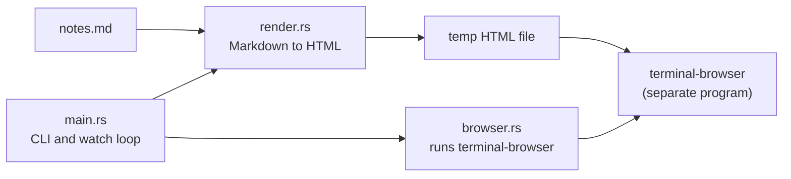
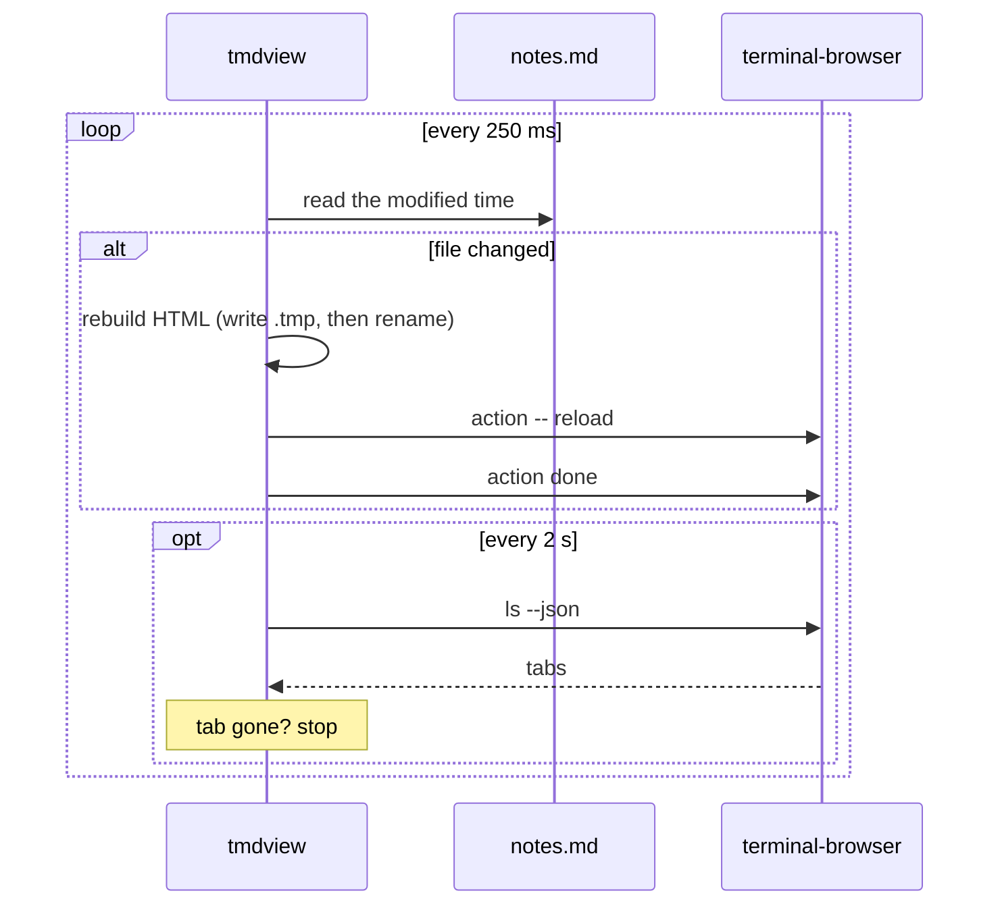

# Architecture

This page explains how tmdview works, for anyone reading or changing the code.
The whole program is about 600 lines of Rust in four files.

## What happens when you run it

Running `tmdview notes.md --split right --watch` does this:

1. Reads `notes.md` and turns it into one self-contained HTML file in a temp folder.
2. Lists the browser tabs that are already open.
3. Runs `terminal-browser open <file> --split right`.
4. Finds the new tab that shows the file.
5. Checks `notes.md` every 250 ms. When it changes, rebuilds the HTML and reloads that tab.
6. Stops when you close the tab.

## Files

| File | Job |
|---|---|
| `src/main.rs` | Command-line flags, where the output goes, the watch loop, where messages go |
| `src/render.rs` | Markdown to a full HTML page, syntax colors, heading IDs, file URLs |
| `src/template.html` | Page layout, CSS for both themes, the script that keeps your scroll position |
| `src/browser.rs` | Runs the `terminal-browser` command and reads its JSON output |

`template.html` is built into the binary with `include_str!`, so tmdview is a single file with nothing to install next to it.

## Rendering

`render.rs` uses [pulldown-cmark](https://github.com/pulldown-cmark/pulldown-cmark) to parse the Markdown.
The parser produces a stream of events (start of a heading, some text, end of a heading, and so on).
tmdview changes three kinds of events before turning the stream into HTML:

| Event | What tmdview does |
|---|---|
| Code block | Collects the code, then colors it with [syntect](https://github.com/trishume/syntect). Unknown languages are shown plain and escaped. |
| Heading | Turns the heading's text into an ID, so `## How it works` gets `id="how-it-works"`. Repeats get `-1`, `-2` and so on. |
| Math | Wraps `$...$` in `` and `$$...$$` in `
`, without typesetting. |

A heading can also set its own ID, like `# Intro {#intro}`.
Before the main pass, tmdview reads all of these custom IDs, so a generated ID never takes one of them.

### Syntax colors and themes

syntect writes CSS classes (prefixed `hl-`) into the HTML, not inline colors.
That makes it possible to switch the code's colors with the page theme.
The page has 2 sets of code colors:

- `InspiredGitHub` for light mode
- `base16-ocean.dark` for dark mode

The dark rules sit under `:root[data-theme="dark"]` and under a `prefers-color-scheme: dark` media query.
`--theme light` or `--theme dark` sets `data-theme` on the `<html>` tag, which overrides the system setting.

### Relative links and images

The page lives in a temp folder, not next to your Markdown.
To keep `` working, the page sets `<base href>` to the Markdown file's folder.
That path is percent-encoded, so folders with spaces, `#` or `?` in their names still work.

## The output file

By default the HTML goes to `<temp>/tmdview/<name>-<hash>.html`.
The hash comes from the Markdown file's full path, so the same file always gets the same HTML path.

Each write goes to a `.tmp` file first, then renames it into place.
Without that, a reload that happens mid-write can show a half-written page.

## Opening the browser

`browser.rs` doesn't embed a browser. It runs the `terminal-browser` command, the same way you would in a shell.
There are 2 ways to open the page:

| Mode | Command | What happens |
|---|---|---|
| `--split <dir>` | `terminal-browser open <file> --split <dir>` | A new pane opens next to yours. The command returns at once. |
| Default | `terminal-browser open <file>` | The browser takes over your pane until you quit it. |

terminal-browser can also add the page as a tab to a browser that's already open nearby, instead of opening a new one.
In that case the command exits right away, in both modes.

## Finding the right tab

Reloading needs the browser key and tab ID of the page you just opened.
tmdview finds them like this:

1. Before opening, it saves the list from `terminal-browser ls --json`.
2. After opening, it lists again and looks for a tab showing the HTML file that wasn't there before.
3. It retries every 150 ms, for up to 6 seconds, while the browser starts.
4. If no new tab turns up, it uses any tab showing the file.

Step 2 matters when you open the same file twice. Both tabs show the same URL, and each tmdview has to reload its own tab.

The browser reports URLs percent-encoded (`caf%C3%A9%20notes.html`).
tmdview decodes them before comparing, so it matches file names with spaces or accents.

## The watch loop

Checking one file's modified time 4 times a second is cheap, and it also catches editors that save by replacing the file.
Some editors delete the file and then write a new one, so while the file is missing, tmdview waits for it to come back.

terminal-browser shows a notice while a tool is controlling a tab.
tmdview runs `action done` after every reload to clear it right away.

A failed reload doesn't stop the watch.
tmdview checks whether the tab still exists, and if it does, it tries again on the next change.

### Where messages go

In the default mode the browser draws over your whole pane, so any message printed there would mess up the screen.
While the browser process runs, messages go to `<temp>/tmdview/<name>-<hash>.log`.
When the browser exits, messages go back to stderr.

## Keeping your place on reload

A small script at the end of `template.html` saves the scroll position before each reload and restores it afterwards.
It uses `sessionStorage`, one entry per page.
It restores on the `load` event, after images have loaded, so the page is tall enough to scroll back.

## Design choices

| Choice | Why | Cost |
|---|---|---|
| Run the `terminal-browser` command, don't speak its protocol | The command is its supported interface, and it handles panes and tab merging | A new process for every reload and tab check |
| Poll the file | No extra dependency, works with every editor's save method | Up to 250 ms before a change shows |
| Open a `file://` page, no local web server | Nothing to start, stop or secure | The page can't push its own updates, so tmdview has to reload it |
| CSS classes for code colors | One page works in both themes | Slightly bigger HTML, since both themes' CSS is included |
| One self-contained HTML file | Works offline, easy to save with `-o` | No KaTeX or Mermaid rendering, since those need JavaScript libraries |

## Known limits

- Math is shown as plain text.
- Mermaid blocks are shown as code, not as diagrams.
- The default mode (browser takes over the pane) has only been tested by hand.
- Only macOS has been tried.

## Tests

`cargo test` runs 7 unit tests. They cover:

- heading IDs, including duplicates and custom `{#id}`s
- syntax colors, and plain output for unknown languages
- tables, task lists and strikethrough
- percent-encoding and decoding of file paths

Nothing that runs `terminal-browser` has automated tests, because it needs a real terminal and a running browser.
