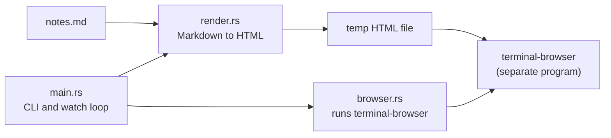
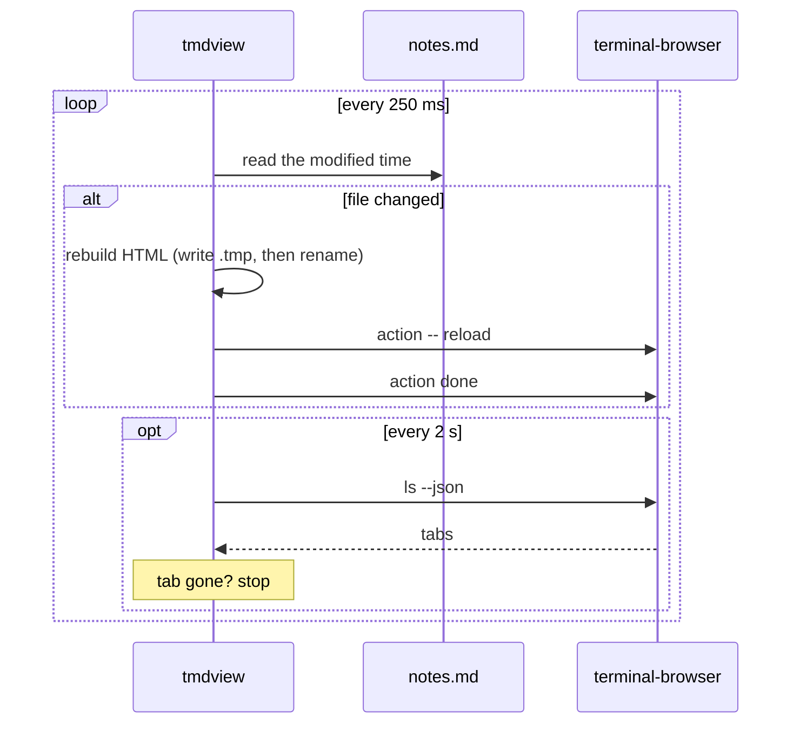

# Architecture

This page explains how tmdview works, for anyone reading or changing the code.
The whole program is about 1,450 lines of Rust in seven files.

## What happens when you run it

Running `tmdview notes.md --split right --watch` does this:

1. Reads `notes.md` and turns it into one self-contained HTML file in a temp folder.
2. Lists the browser tabs that are already open.
3. Runs `terminal-browser open <file> --split right`.
4. Finds the new tab that shows the file.
5. Checks `notes.md` every 250 ms. When it changes, rebuilds the HTML and reloads that tab.
6. Stops when you close the tab.

## Files

| File | Job |
|---|---|
| `src/main.rs` | Command-line flags, where the output goes, the watch loop, where messages go |
| `src/render.rs` | Markdown to a full HTML page, syntax colors, heading IDs, file URLs |
| `src/template.html` | Page layout, CSS for both themes, the script that keeps your scroll position |
| `src/browser.rs` | Runs the `terminal-browser` command and reads its JSON output |
| `src/plugins/mod.rs` | The `plugins` subcommand, loading installed plugins, conflict checks, inlining their files |
| `src/plugins/builtin.rs` | Built-in plugins: pinned downloads with checksums, and their start-up scripts |
| `src/plugins/git.rs` | Git plugins: the manifest, cloning, updating and removing |

`template.html` is built into the binary with `include_str!`, so tmdview is a single file with nothing to install next to it.
Plugins are the one exception, and they're optional.

## Plugins

A plugin is JavaScript and CSS that tmdview inlines into pages that have a code block it claims.
There are 2 kinds, and both install into `<data folder>/tmdview/plugins/<name>/`.
The data folder comes from the `dirs` crate.

| Kind | Where it comes from | Example |
|---|---|---|
| Built-in | A pinned download described in `builtin.rs` | `mermaid` |
| Git | Any git repository with a `tmdview-plugin.toml` manifest | `slara/tmdview-highlight` |

Neither is kept in this repo, so `cargo install --git` stays small.
Either way, a plugin becomes a `Loaded` value: its name, the languages it claims, whether it's the fallback, and its files' contents.
[PLUGINS.md](PLUGINS.md) is the guide for plugin authors.

### Built-in plugins

Each built-in plugin has a `Spec` in `builtin.rs`: a name, a pinned version, a URL and a SHA-256 checksum, plus the languages it claims and a start-up script.
`tmdview plugins install <name>` downloads the URL with `ureq`, checks the checksum, and saves the file to
`<plugins>/<name>/<version>/`.
It writes a temp file and renames it, so a failed install never leaves a partial library.
A download over 32 MB, or one with the wrong checksum, is rejected.

The version is part of the path, so when tmdview pins a new version, the old file is simply ignored.
`plugins list` then shows the plugin as not installed until you install it again.
`plugins remove` deletes the plugin's folder, with every version in it.

To bump a plugin, change `version`, `url` and `sha256` together.
Get the checksum with `curl -sL <url> | shasum -a 256`.
To add one, add a `Builtin` variant and its `Spec`.

### Git plugins

`git.rs` runs the user's own `git` command, not a git library.
That way private repositories work with the user's SSH keys and credential helpers, and git's prompts and errors reach the terminal.

A git plugin lives in `<plugins>/<name>/`, with the clone in `repo/` and a `source.json` that records the URL and the `--ref`, if one was given.
Install works like this:

1. Turn the source into a URL. `owner/repo` becomes a GitHub URL, and a local path becomes absolute so `update` can find it later.
2. Clone it into a staging folder, `<plugins>/.install-<pid>/`, and check out `--ref` if given.
3. Read and check the manifest: a valid name that isn't a built-in's, at least one language or `fallback`, and files that stay inside the repository (symlinks included).
4. Refuse the plugin if another installed plugin claims one of its languages, or if both are the fallback.
5. Show what it takes over and ask for confirmation. Without a terminal, this needs `--yes`.
6. Rename the staging folder into place. If any step fails, the staging folder is deleted.

`update` fetches, then moves to the newest commit of `--ref`, or of the default branch if no ref was given.
It runs the same checks and the same question, and goes back to the old commit if either fails.

### Rendering

At start-up, tmdview reads every installed plugin into memory, unless `--no-plugins` is set.
Built-ins come first, then git plugins by name.
A git plugin that fails to load is skipped with a warning, so it can't stop the page from opening.

For each fenced code block, the renderer takes the first of these that applies:

1. A plugin that claims the language.
2. syntect.
3. The fallback plugin, if the block has a language.
4. Plain escaped text.

A claimed block becomes `<pre class="tmdview-plugin" data-plugin="<name>" data-lang="<lang>"><code>…</code></pre>`.
The renderer only adds a plugin's files when the page has at least one block the plugin claimed, so pages without diagrams stay small even with Mermaid installed.
Before inlining, it rewrites `</script` as `<\/script` in scripts, and `</style` as `<\/style` in styles, so a file can't close its own tag.

The files go in at the `{{plugins}}` marker in `template.html`.
tmdview splits the template at that marker before filling in the other placeholders.
That way it never searches a 5.5 MB library, or the page body, for `{{...}}`.

Before the plugins, the template defines `tmdview.ready(promise)`.
A plugin that draws after the page loads, like Mermaid, passes its drawing promise to it.
The scroll script waits for all of them before it restores your position, since drawing changes the page height.

## Rendering

`render.rs` uses [pulldown-cmark](https://github.com/pulldown-cmark/pulldown-cmark) to parse the Markdown.
The parser produces a stream of events (start of a heading, some text, end of a heading, and so on).
tmdview changes three kinds of events before turning the stream into HTML:

| Event | What tmdview does |
|---|---|
| Code block | Collects the code, then colors it with [syntect](https://github.com/trishume/syntect). Unknown languages are shown plain and escaped. |
| Heading | Turns the heading's text into an ID, so `## How it works` gets `id="how-it-works"`. Repeats get `-1`, `-2` and so on. |
| Math | Wraps `$...$` in `` and `$$...$$` in `
`, without typesetting. |

A heading can also set its own ID, like `# Intro {#intro}`.
Before the main pass, tmdview reads all of these custom IDs, so a generated ID never takes one of them.

### Syntax colors and themes

syntect writes CSS classes (prefixed `hl-`) into the HTML, not inline colors.
That makes it possible to switch the code's colors with the page theme.
The page has 2 sets of code colors:

- `InspiredGitHub` for light mode
- `base16-ocean.dark` for dark mode

The dark rules sit under `:root[data-theme="dark"]` and under a `prefers-color-scheme: dark` media query.
`--theme light` or `--theme dark` sets `data-theme` on the `<html>` tag, which overrides the system setting.

### Relative links and images

The page lives in a temp folder, not next to your Markdown.
To keep `` working, the page sets `<base href>` to the Markdown file's folder.
That path is percent-encoded, so folders with spaces, `#` or `?` in their names still work.

## The output file

By default the HTML goes to `<temp>/tmdview/<name>-<hash>.html`.
The hash comes from the Markdown file's full path, so the same file always gets the same HTML path.

Each write goes to a `.tmp` file first, then renames it into place.
Without that, a reload that happens mid-write can show a half-written page.

## Opening the browser

`browser.rs` doesn't embed a browser. It runs the `terminal-browser` command, the same way you would in a shell.
There are 2 ways to open the page:

| Mode | Command | What happens |
|---|---|---|
| `--split <dir>` | `terminal-browser open <file> --split <dir>` | A new pane opens next to yours. The command returns at once. |
| Default | `terminal-browser open <file>` | The browser takes over your pane until you quit it. |

terminal-browser can also add the page as a tab to a browser that's already open nearby, instead of opening a new one.
In that case the command exits right away, in both modes.

## Finding the right tab

Reloading needs the browser key and tab ID of the page you just opened.
tmdview finds them like this:

1. Before opening, it saves the list from `terminal-browser ls --json`.
2. After opening, it lists again and looks for a tab showing the HTML file that wasn't there before.
3. It retries every 150 ms, for up to 6 seconds, while the browser starts.
4. If no new tab turns up, it uses any tab showing the file.

Step 2 matters when you open the same file twice. Both tabs show the same URL, and each tmdview has to reload its own tab.

The browser reports URLs percent-encoded (`caf%C3%A9%20notes.html`).
tmdview decodes them before comparing, so it matches file names with spaces or accents.

## The watch loop

Checking one file's modified time 4 times a second is cheap, and it also catches editors that save by replacing the file.
Some editors delete the file and then write a new one, so while the file is missing, tmdview waits for it to come back.

terminal-browser shows a notice while a tool is controlling a tab.
tmdview runs `action done` after every reload to clear it right away.

A failed reload doesn't stop the watch.
tmdview checks whether the tab still exists, and if it does, it tries again on the next change.

### Where messages go

In the default mode the browser draws over your whole pane, so any message printed there would mess up the screen.
While the browser process runs, messages go to `<temp>/tmdview/<name>-<hash>.log`.
When the browser exits, messages go back to stderr.

## Keeping your place on reload

A small script at the end of `template.html` saves the scroll position before each reload and restores it afterwards.
It uses `sessionStorage`, one entry per page.
It restores on the `load` event, after images have loaded, so the page is tall enough to scroll back.

## Design choices

| Choice | Why | Cost |
|---|---|---|
| Run the `terminal-browser` command, don't speak its protocol | The command is its supported interface, and it handles panes and tab merging | A new process for every reload and tab check |
| Poll the file | No extra dependency, works with every editor's save method | Up to 250 ms before a change shows |
| Open a `file://` page, no local web server | Nothing to start, stop or secure | The page can't push its own updates, so tmdview has to reload it |
| CSS classes for code colors | One page works in both themes | Slightly bigger HTML, since both themes' CSS is included |
| One self-contained HTML file | Works offline, easy to save with `-o` | Plugins inline their whole library, so a Mermaid page is about 5.5 MB |
| Plugins are downloaded, not in the repo | A git install stays small, and you only get what you use | One network step per plugin, and `ureq` adds about 2 MB to the binary |
| Installed means on | Nothing to enable per run, since scripts only go into pages that need them | Use `--no-plugins` to turn them off for one run |
| Git plugins use the `git` command | Private repositories and credentials work with no extra setup | Needs `git` installed, but only for git plugins |
| Git plugins ask before installing | They run someone else's JavaScript in your pages | Scripts have to pass `--yes` |

## Known limits

- Math is shown as plain text.
- Mermaid blocks are shown as code unless the `mermaid` plugin is installed.
- A Mermaid page doesn't redraw if the system theme changes while it's open. It picks up the change on the next reload.
- The default mode (browser takes over the pane) has only been tested by hand.
- Only macOS has been tried.

## Tests

`cargo test` runs 16 unit tests. They cover:

- heading IDs, including duplicates and custom `{#id}`s
- syntax colors, and plain output for unknown languages
- tables, task lists and strikethrough
- percent-encoding and decoding of file paths
- plugins: claimed blocks, files added once, pages without claimed blocks left alone, and the claim order (claimed language, syntect, fallback, plain)
- conflicts between plugins, and escaping `</script` in inlined files
- git plugins: GitHub shorthand, plugin names, and manifest files that try to leave the repository

Downloading and cloning plugins have no automated tests, since they need the network or a git repository.
Nothing that runs `terminal-browser` has automated tests, because it needs a real terminal and a running browser.
