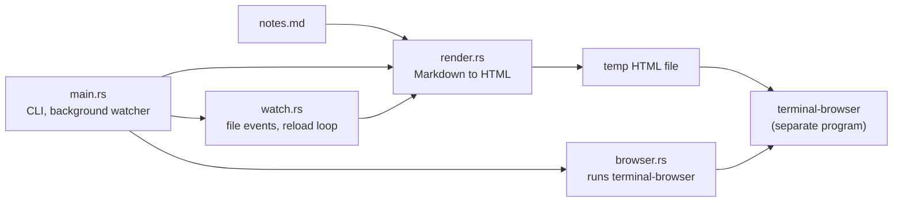
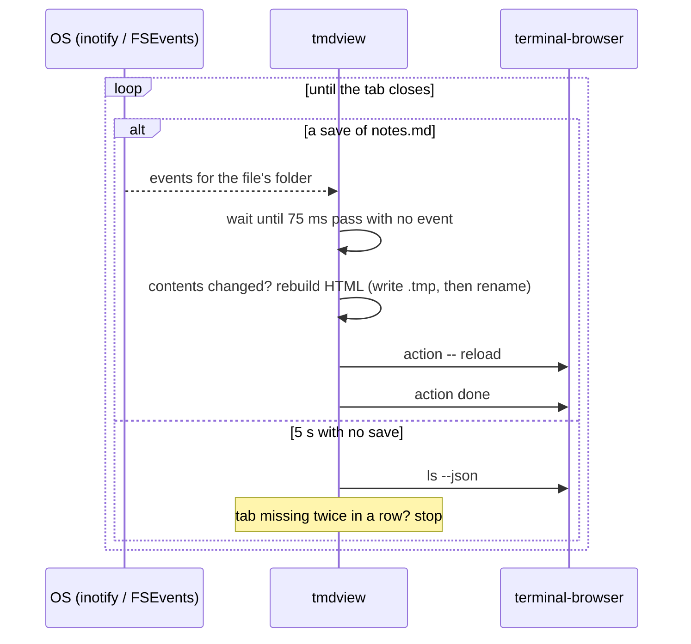

# Architecture

This page explains how tmdview works, for anyone reading or changing the code.
The whole program is about 2,100 lines of Rust in nine files.

## What happens when you run it

Running `tmdview notes.md --split right` does this:

1. Reads `notes.md` and turns it into one self-contained HTML file in a temp folder.
2. Lists the browser tabs that are already open.
3. Runs `terminal-browser open <file> --split right`.
4. Starts a background copy of itself, opens the page in a new pane, and returns, so your shell is free.
5. The background copy finds the new tab that shows the file.
6. It waits for the OS to report a save of `notes.md`, then rebuilds the HTML and reloads that tab.
7. It stops when you close the tab.

## Files

| File | Job |
|---|---|
| `src/main.rs` | Command-line flags, where the output goes, starting the background watcher, where messages go |
| `src/watch.rs` | File change events with a polling fallback, and the loop that rebuilds and reloads |
| `src/render.rs` | Markdown to a full HTML page, syntax colors, heading IDs, file URLs |
| `src/template.html` | Page layout, CSS for both themes, the script that keeps your scroll position |
| `src/terminal.rs` | `--theme terminal`: asks the terminal for its colors, reads Ghostty's config, builds the matching CSS |
| `src/browser.rs` | Runs the `terminal-browser` command and reads its JSON output |
| `src/plugins/mod.rs` | The `plugins` subcommand, loading installed plugins, conflict checks, inlining their files |
| `src/plugins/builtin.rs` | Built-in plugins: pinned downloads with checksums, and their start-up scripts |
| `src/plugins/git.rs` | Git plugins: the manifest, cloning, updating and removing |

`template.html` is built into the binary with `include_str!`, so tmdview is a single file with nothing to install next to it.
Plugins are the one exception, and they're optional.

## Plugins

A plugin is JavaScript and CSS that tmdview inlines into pages that have a code block it claims.
There are 2 kinds, and both install into `<data folder>/tmdview/plugins/<name>/`.
The data folder is `~/Library/Application Support` on macOS and `$XDG_DATA_HOME` (or `~/.local/share`) elsewhere.

| Kind | Where it comes from | Example |
|---|---|---|
| Built-in | A pinned download described in `builtin.rs` | `mermaid` |
| Git | Any git repository with a `tmdview-plugin.toml` manifest | `slara/tmdview-highlight`, `slara/tmdview-mts` |

Neither is kept in this repo, so `cargo install --git` stays small.
Either way, a plugin becomes a `Loaded` value: its name, the languages it claims, whether it's the fallback, the front matter keys it runs on, and its files' contents.
[PLUGINS.md](PLUGINS.md) is the guide for plugin authors.

### Built-in plugins

Each built-in plugin is a `Builtin` const in `builtin.rs`: a name, a pinned version, a URL and a SHA-256 checksum, plus the languages it claims and a start-up script.
`tmdview plugins install <name>` downloads the URL with the user's `curl`, checks the checksum, and saves the file to
`<plugins>/<name>/<version>/`.
It writes a temp file and renames it, so a failed install never leaves a partial library.
A download over 32 MB, or one with the wrong checksum, is rejected.

The version is part of the path, so when tmdview pins a new version, tmdview ignores the old file.
`plugins list` shows the plugin as not installed until you install it again.
`plugins remove` deletes the plugin's folder, with every version in it.

To bump a plugin, change `version`, `url` and `sha256` together.
Get the checksum with `curl -sL <url> | shasum -a 256`.
To add one, add a `Builtin` const and list it in `Builtin::ALL`.

### Git plugins

`git.rs` runs the user's own `git` command, not a git library.
That way private repositories work with the user's SSH keys and credential helpers, and git's prompts and errors reach the terminal.

A git plugin lives in `<plugins>/<name>/`, with the clone in `repo/` and a `source.json` that records the URL and the `--ref`, if one was given.
Install works like this:

1. Turn the source into a URL. `owner/repo` becomes a GitHub URL, and a local path becomes absolute so `update` can find it later.
2. Clone it into a staging folder, `<plugins>/.install-<pid>/`, and check out `--ref` if given.
3. Read and check the manifest: a valid name that isn't a built-in's, at least one language or `fallback`, and files that stay inside the repository (symlinks included).
4. Refuse the plugin if another installed plugin claims one of its languages, or if both are the fallback.
5. Show what it takes over and ask for confirmation. Without a terminal, this needs `--yes`.
6. Rename the staging folder into place. If any step fails, the staging folder is deleted.

`update` fetches, then finds the newest commit of `--ref`, or of the default branch if no ref was given.
It checks that commit in a throwaway clone, `<plugins>/<name>/.update-<pid>/`, made with `git clone --shared` so it copies no objects.
It runs the same checks and asks the same question, and only then moves the installed repo to the new commit.
Until you answer yes, the installed plugin doesn't change, even if you press Ctrl+C or the process is killed.

### Rendering

At start-up, tmdview reads every installed plugin into memory, unless `--no-plugins` is set.
Built-ins come first, then git plugins by name.
A git plugin that fails to load is skipped with a warning, so it can't stop the page from opening.

For each fenced code block, the renderer takes the first of these that applies:

1. A plugin that claims the language.
2. syntect.
3. The fallback plugin, if the block has a language.
4. Plain escaped text.

A claimed block becomes `<pre class="tmdview-plugin" data-plugin="<name>" data-lang="<lang>"><code>…</code></pre>`, plus `data-info` with the rest of the fence's info string, if there is any.

A page with front matter gets it as JSON in `` doesn't end the tag and the rest of the page is swallowed.
Rewriting those strings could break the code, so that rare script goes in as a percent-encoded `data:` URL instead, which has no markup in it.

The files go in at the `{{plugins}}` marker in `template.html`.
tmdview splits the template at that marker before filling in the other placeholders.
That way it never searches a 5.5 MB library, or the page body, for `{{...}}`.

Before the plugins, the template defines `tmdview.ready(promise)`.
A plugin that draws after the page loads, like Mermaid, passes its drawing promise to it.
The scroll script waits for all of them before it restores your position, since drawing changes the page height.

## Rendering

`render.rs` uses [pulldown-cmark](https://github.com/pulldown-cmark/pulldown-cmark) to parse the Markdown.
The parser produces a stream of events (start of a heading, some text, end of a heading, and so on).
tmdview changes four kinds of events before turning the stream into HTML:

| Event | What tmdview does |
|---|---|
| Code block | Collects the code, then colors it with [syntect](https://github.com/trishume/syntect). Unknown languages are shown plain and escaped. |
| Heading | Turns the heading's text into an ID, so `## How it works` gets `id="how-it-works"`. Repeats get `-1`, `-2` and so on. Reads trailing `{…}` attributes itself (see below). |
| Table cell | Wraps a cell with no spaces, like `D-01` or a date, in ``, so a narrow column doesn't break it after a hyphen. |
| Math | Wraps `$...$` in `` and `$$...$$` in `
`, without typesetting. |

pulldown-cmark finds a heading's trailing `{#id .class key=value}`, but it doesn't understand quoted values, so `{title="Mapa de planta"}` would come apart at the spaces.
tmdview reads that part of the heading's source line again, with quotes.
Each `key=value` becomes `data-key`, so it can't clash with the heading's `id` or add a `title` tooltip.

The parser also recognizes front matter, a `---` YAML or `+++` TOML block at the top of the file, and the HTML writer leaves it out.
Without that, the block would show up as a line, a paragraph and a heading.

A heading can also set its own ID, like `# Intro {#intro}`.
Before the main pass, tmdview reads all of these custom IDs, so a generated ID never takes one of them.

### Syntax colors and themes

syntect writes CSS classes (prefixed `hl-`) into the HTML, not inline colors, so the code's colors can change with the page theme.
The page has 2 sets of code colors:

- `InspiredGitHub` for light mode
- `base16-ocean.dark` for dark mode

The dark rules sit under `:root[data-theme="dark"]` and under a `prefers-color-scheme: dark` media query.
`--theme light` or `--theme dark` sets `data-theme` on the `<html>` tag, which overrides the system setting.

### The terminal theme

`--theme terminal` reads the look of the terminal tmdview runs in, in `terminal.rs`:

1. It opens `/dev/tty`, turns off echo and line buffering, and sends OSC 10 and 11 queries for the foreground and background.
2. It ends the queries with a device attributes request (`ESC [ c`), which every terminal answers. Once that answer arrives, there's nothing more to wait for, so a terminal that ignores the color queries costs one round trip. It gives up after 500 ms.
3. A color still missing, and the font, come from `ghostty +show-config` when running in Ghostty.
4. If there's still no background and foreground, tmdview says so and uses the `auto` theme.

The page gets `data-theme="dark"` or `"light"`, from whether the background is darker than the text, so plugins pick the matching theme.
The terminal CSS takes the place of syntect's code colors, after the page's own CSS, so tmdview doesn't build syntect's CSS at all.
It sets the page's background, text and gray variables from the terminal's two colors, and the link, highlight and code colors from GitHub Dark or GitHub Light, whichever matches the background.
The rest is fixed CSS in terms of those variables: it maps code scopes (comments, strings, keywords and so on) the way GitHub does, and sets all text in the terminal font at 14px with smaller headings, since monospace runs wide.
It doesn't use the terminal's ANSI palette: those colors are tuned for a terminal, and read loud on a page.

The background watcher has no terminal to ask, so tmdview passes the colors it found to it as JSON, in the hidden `--terminal-style` flag.

### Relative links and images

The page lives in a temp folder, not next to your Markdown.
To keep `` working, the page sets `<base href>` to the Markdown file's folder.
That path is percent-encoded, so folders with spaces, `#` or `?` in their names still work.

## The output file

By default the HTML goes to `<temp>/tmdview/<name>-<hash>.html`.
The hash comes from the Markdown file's full path, so the same file always gets the same HTML path.

Each write goes to a `.tmp` file first, then renames it into place.
Without that, a reload that happens mid-write can show a half-written page.

## Opening the browser

`browser.rs` doesn't embed a browser. It runs the `terminal-browser` command, the same way you would in a shell.
There are 2 ways to open the page:

| Mode | Command | What happens |
|---|---|---|
| `--split <dir>` | `terminal-browser open <file> --split <dir>` | A new pane opens next to yours. The command returns at once. |
| Default | `terminal-browser open <file>` | The browser takes over your pane until you quit it. |

terminal-browser can also add the page as a tab to a browser that's already open nearby, instead of opening a new one.
In that case the command exits right away, in both modes.

## Finding the right tab

Reloading needs the browser key and tab ID of the page you just opened.
tmdview finds them like this:

1. Before opening, it saves the list from `terminal-browser ls --json`.
2. After opening, it lists again and looks for a tab showing the HTML file that wasn't there before.
3. It retries every 150 ms, for up to 6 seconds, while the browser starts.
4. If no new tab turns up, it uses any tab showing the file.

Step 2 matters when you open the same file twice. Both tabs show the same URL, and each tmdview has to reload its own tab.

The browser reports URLs percent-encoded (`caf%C3%A9%20notes.html`).
tmdview decodes them before comparing, so it matches file names with spaces or accents.

## Reloading on save

tmdview reloads the page every time you save the Markdown file, unless you pass `--no-watch`.

### Where changes come from

`watch.rs` uses the [notify](https://github.com/notify-rs/notify) crate, which gets change events from the OS: inotify on Linux, FSEvents on macOS.
tmdview uses no CPU while you're not saving, and a save shows up within milliseconds.

It watches the file's folder, not the file itself.
Vim, VS Code and most editors save by writing a temp file and renaming it over the original, which replaces the file.
On Linux, a watch on the file itself stops working after the first such save.
Watching the folder (not its subfolders) catches every save style, and tmdview ignores events for other file names.

Reading a file produces events on Linux too, so tmdview only counts events that can change the file: create, modify and remove.
Otherwise every rebuild, which reads the file, would trigger another rebuild.

One save produces several events (a write, a rename, an attribute change).
tmdview waits until 75 ms pass without an event, then rebuilds once.
It hashes the Markdown and skips the rebuild and reload if the contents didn't change, so `touch` or a save with no edits does nothing.
If the file is missing for a moment, because an editor deleted it before writing it again, tmdview waits for the next event.

Network drives (NFS, SMB), some Docker mounts and WSL's `/mnt` don't always report changes.
For those, `--poll` checks the file every 250 ms and compares its contents.
tmdview also polls on its own if the OS watcher can't start, and it says so in its log.

### The background watcher

In both modes, a background copy of tmdview does the watching.
tmdview lists the open tabs, then starts itself again with the same arguments plus the hidden `--attach <tabs>` flag, which carries that list.
Only then does it open the browser.
The copy runs in its own process group, so Ctrl-C in the shell doesn't stop it.
It finds the tab that shows the page and isn't in the list, which can take a few seconds while a browser starts, and then watches.

Passing the same arguments means the copy renders the page exactly like the tmdview that started it, with no flag to forget.
It doesn't write the page again, since that's already done.

With `--split`, tmdview returns as soon as the pane is open.
In the default mode, it waits until you quit the browser that took over your pane.
If terminal-browser adds the page as a tab to a browser that's already open nearby and exits at once, tmdview returns at once too, and the watcher still reloads that tab.

### Stopping

When nothing changes for 5 seconds, or a reload fails, tmdview checks with `ls --json` that the tab still exists.
It stops only when the tab is missing twice in a row, since one missing answer can be a browser hiccup.
So it stops within about 10 seconds of you closing the tab.
After a failed reload with the tab still open, it tries again on the next save.

terminal-browser shows a notice while a tool is controlling a tab.
tmdview runs `action done` after every reload to clear it right away.

### Where messages go

The background watcher has no terminal, so it writes to `<temp>/tmdview/<name>-<hash>.log`, starting a fresh file each time.
With `--split`, tmdview prints that path when it starts.

## Keeping your place on reload

A small script at the end of `template.html` saves the scroll position before each reload and restores it afterwards.
It uses `sessionStorage`, one entry per page.
It restores on the `load` event, after images have loaded, so the page is tall enough to scroll back.

## Design choices

| Choice | Why | Cost |
|---|---|---|
| Run the `terminal-browser` command, don't speak its protocol | The command is its supported interface, and it handles panes and tab merging | A new process for every reload and tab check |
| OS file events, watching the folder | No CPU while idle, and a save shows up at once, whatever way the editor saves | Adds `notify`. Filesystems without events need `--poll` |
| Always reload on save, from a background process | Saving is all you do. The shell is free right away | A process that lives until you close the tab, up to 10 seconds after |
| Open a `file://` page, no local web server | Nothing to start, stop or secure | The page can't push its own updates, so tmdview has to reload it |
| CSS classes for code colors | One page works in both themes | Slightly bigger HTML, since both themes' CSS is included |
| One self-contained HTML file | Works offline, easy to save with `-o` | Plugins inline their whole library, so a Mermaid page is about 5.5 MB |
| Plugins are downloaded, not in the repo | A git install stays small, and you only get what you use | One network step per plugin, and it needs `curl` installed |
| Installed means on | Nothing to enable per run, since scripts only go into pages that need them | Use `--no-plugins` to turn them off for one run |
| Git plugins use the `git` command | Private repositories and credentials work with no extra setup | Needs `git` installed, but only for git plugins |
| Git plugins ask before installing | They run someone else's JavaScript in your pages | Scripts have to pass `--yes` |

## Known limits

- Math is shown as plain text.
- Mermaid blocks are shown as code unless the `mermaid` plugin is installed.
- A Mermaid page doesn't redraw if the system theme changes while it's open. It picks up the change on the next reload.
- The terminal theme can't read the font outside Ghostty, and doesn't follow a theme change until you run tmdview again.
- The default mode (browser takes over the pane) has only been tested by hand.
- The whole tool has only been tried on macOS. On Linux, only the tests have run, in a Docker container, including the file-event tests with inotify.

## Tests

`cargo test` runs 32 tests. They cover:

- heading IDs, including duplicates and custom `{#id}`s
- syntax colors, and plain output for unknown languages
- tables, task lists and strikethrough, front matter, and table cells kept on one line
- heading attributes with quoted values, front matter in the page and its keys, and the plugins it adds, `data-info` on plugin blocks
- percent-encoding and decoding of file paths
- plugins: claimed blocks, files added once, pages without claimed blocks left alone, and the claim order (claimed language, syntect, fallback, plain)
- conflicts between plugins, escaping `</script` in inlined files, and the `data:` URL for risky scripts
- git plugins: GitHub shorthand, plugin names, and manifest files that try to leave the repository
- parsing the background watcher's `--attach` list
- the terminal theme: color formats, terminal replies, Ghostty's config, the CSS, and the JSON sent to the watcher
- watching, with real files, for both file events and polling: a plain write, a rename-over save, a write after it, and nothing for reading the file or changing another file in the folder

Downloading and cloning plugins have no automated tests, since they need the network or a git repository.
Nothing that runs `terminal-browser` has automated tests, because it needs a real terminal and a running browser.
